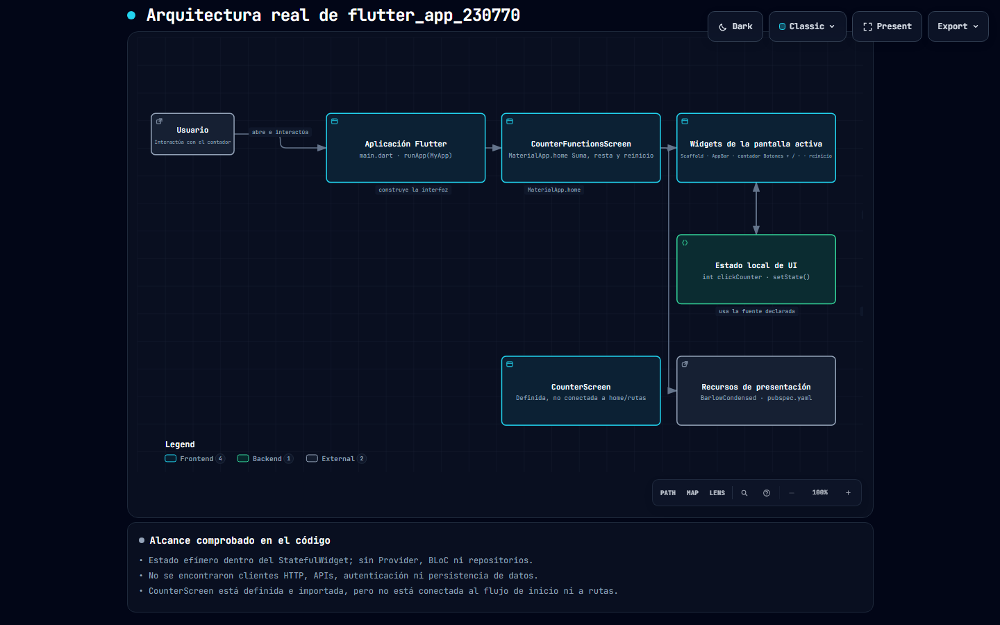

# Práctica 02 — Contador personalizado por Say

## Descripción

En esta práctica se desarrolló una aplicación de **contador en Flutter**, realizando modificaciones en la interfaz y en el comportamiento del contador.

La aplicación permite aumentar y disminuir un valor numérico. Además, se personalizó la apariencia del contador mediante cambios en la **tipografía y los colores**.

Una de las principales características implementadas fue el cambio de color del número dependiendo de su valor:

* 🟢 **Verde:** cuando el contador tiene un valor positivo.
* 🔴 **Rojo:** cuando el contador tiene un valor negativo.
* ⚪ **Color neutro:** cuando el contador se encuentra en cero.

## 🎨 Modificaciones realizadas

| Elemento          | Modificación                                                   |
| ----------------- | -------------------------------------------------------------- |
| Contador          | Se implementó un contador que puede aumentar y disminuir       |
| Tipografía        | Se modificó la tipografía utilizada para mostrar el número     |
| Color del número  | Cambia dependiendo del valor del contador                      |
| Valores positivos | El número se muestra en color verde                            |
| Valores negativos | El número se muestra en color rojo                             |
| Valor cero        | Se utiliza un color neutro                                     |
| Interfaz          | Se realizaron cambios visuales para personalizar la aplicación |

## Evidencia de la práctica

### Contador en un "Click" cuando es igual a 1

### Contador que cambia a "Clicks" cuando es mayor a 1

### Contador en valor positivo

### Contador en valor negativo

### Contador en cero

## 🏗️ Diagrama de arquitectura

A continuación se muestra el diagrama de arquitectura generado para la aplicación:

GitHub Pages del diagrama: https://sayuridbc.github.io/PRACTICAS_DMI_230770/flutter_app_230770/Architecture/architecture.html

Ruta del archivo en el repositorio: [flutter_app_230770/Architecture/architecture.html](flutter_app_230770/Architecture/architecture.html)

También puedes abrirlo localmente en: [Architecture/architecture.html](Architecture/architecture.html)

## 🛠️ Tecnologías utilizadas

* Flutter
* Dart
* Visual Studio Code

## 📌 Conclusión

En esta práctica se reforzó el uso de **Flutter y Dart** mediante la creación y personalización de un contador. Se trabajó con cambios de estilos, tipografía y colores, además de implementar una condición para modificar visualmente el número dependiendo de si su valor es positivo, negativo o cero.
